# Lakehouse POC
## Dataset: TLC Trip Record Data (https://www.nyc.gov/site/tlc/about/tlc-trip-record-data.page)

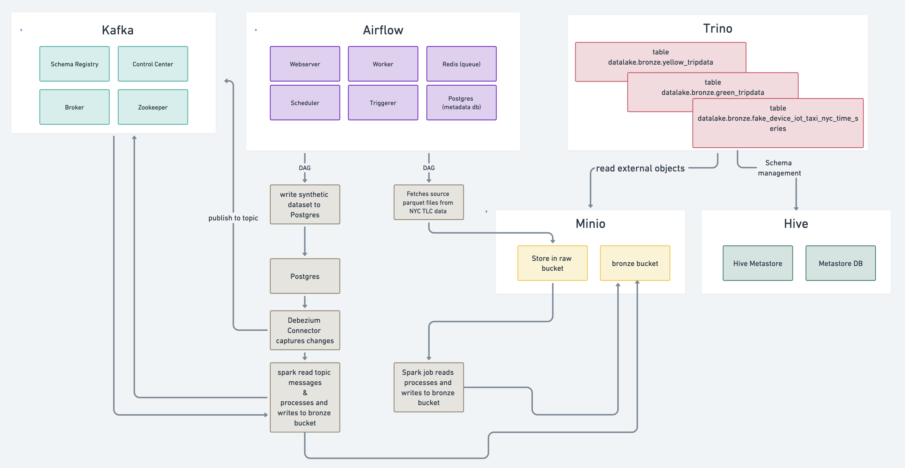

### Step 1: Download the Needed JARs for Spark Jobs

To download the necessary JAR files for running Spark jobs, execute the following command:

```bash
make download_jars
```

### Step 2: Spin up all microservices

```bash
make run_all
```


### Step 2.1: Check if all the containers are in healthy state
```bash
docker ps
```


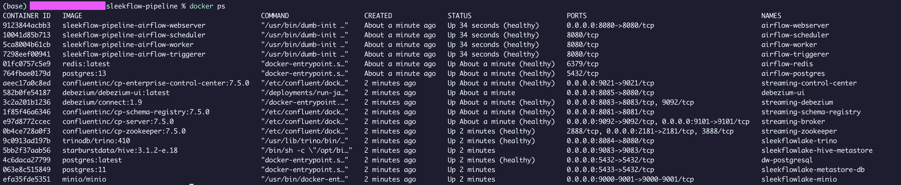

### Step 3: Access Airflow UI

Access `localhost:8080`, Airflow UI, with `airflow` as username & password

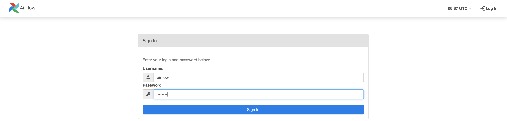

Five dags are present

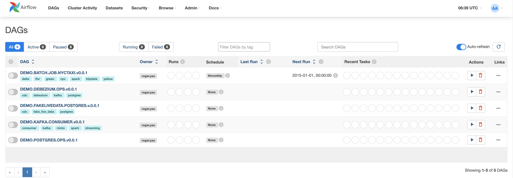

### Step 4 : Postgres and Debezium Steup
Unpause & Trigger Dags:
- `DEMO.POSTGRES.OPS.v0.0.1`
    - to create schema `iot` and table `iot.taxi_nyc_time_series` in postgres
- `DEMO.DEBEZIUM.OPS.v0.0.1`
    - to create connector `taxi-nyc-cdc` that tracks db commis table(s) `iot.taxi_nyc_time_series` and publish the captured commits to kafka topic `device.iot.taxi_nyc_time_series`

### Step 4.1 : Inspect schema and table(s)

```bash
docker exec -it dw-postgresql bash

# psql
psql -U k6 -d k6

# show schema
\dn

```

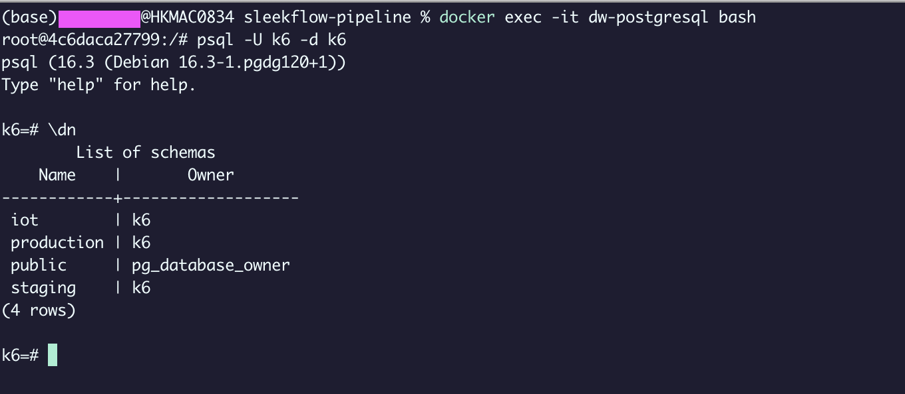

### Step 4.2 : Check if debezium cdc connector `taxi-nyc-cdc` is created successfully


Access debezium UI `http://localhost:8085`

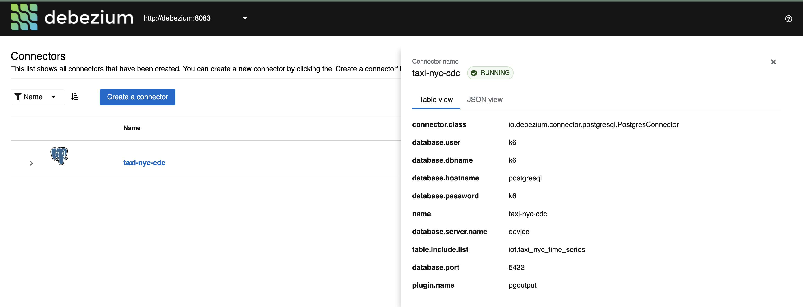


### Step 5 : Write data to postgres db table `iot.taxi_nyc_time_series` with synthetic data


Unpause dag and trigger `DEMO.FAKELIVEDATA.POSTGRES.v.0.0.1`

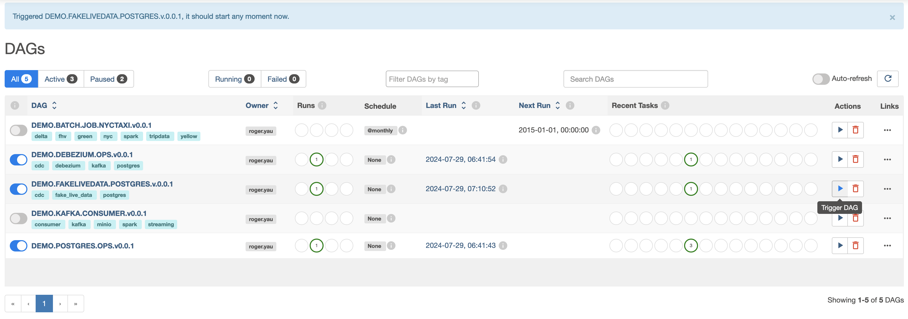

### Step 5.1: Check postgres db `iot.taxi_nyc_time_series` data

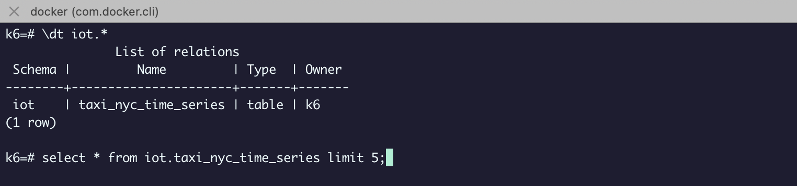

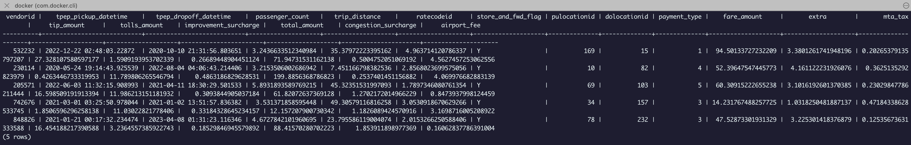


### Step 5.2 Check topic `device.iot.taxi_nyc_time_series` in broker
Access Kafka Control Center at `http://localhost:9021`


Topic created with published synthetic data in the message 
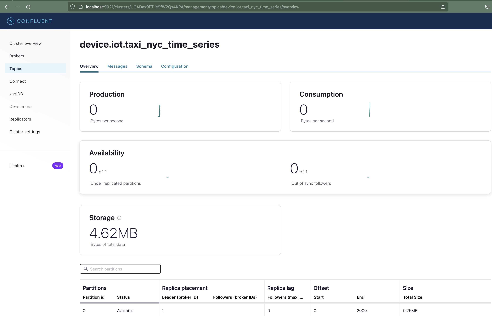

### Step 5.3 Write topic messages into datalake with spark batch read 
- create s3 Minio bucket `bronze` 
- spark read broker `streaming-broker:29092`
- write to object storage in minio
- partition by column `p_date` for efficient read and for analytical uses later

Unpause and trigger dag `DEMO.KAFKA.CONSUMER.v0.0.1`

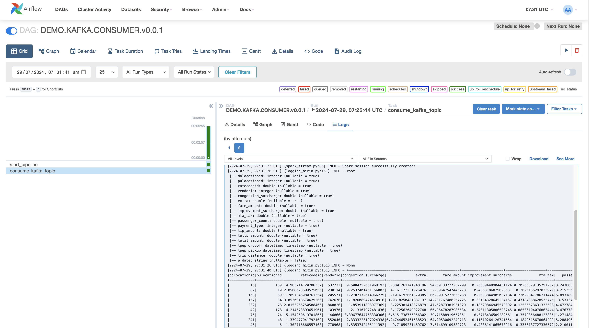

Data written to minio object storage with specified partition

MinIO is accessible at `http://localhost:9001` with `minio_access_key` as username and `minio_secret_key` as password

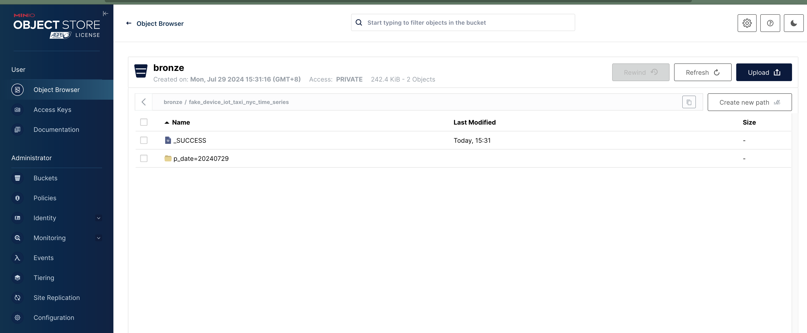


### Step 6: Trigger and run dag `DEMO.BATCH.JOB.NYCTAXI.v0.0.1` with different runs as parallelled backfill job, as well as parallel write with no conurrent write issue like race condition on a sinlge partition

- fetch source data of below entities and store them in bucket `raw`:
    - yellow_tripdata
    - green_tripdata
    - fhv_tripdata
- write to bucket `bronze` partitioned by `p_date` , in delta table format 

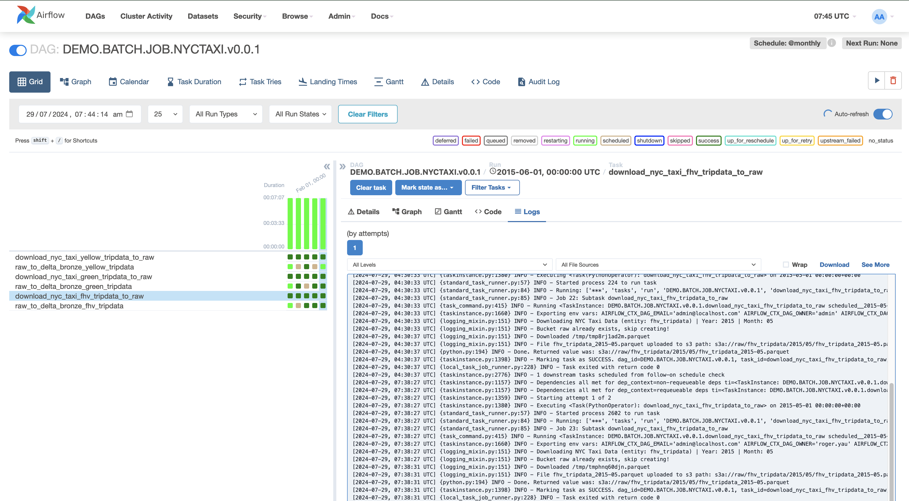

raw bucket with source data 

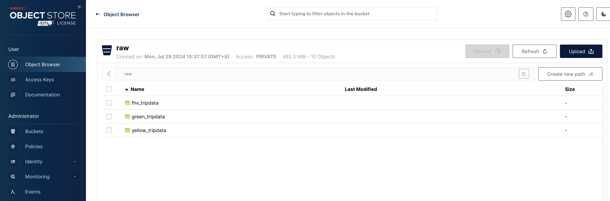

delta table for `yellow_tripdata`, `green_tripdata` and `fhv_tripdata` created with `_delta_log`

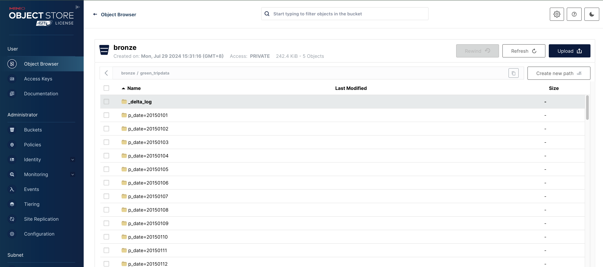


### Step 7: Register schema in hive metastore and query in trinio


```
# docker shell
docker exec -it sleekflowlake-trino bash

# launch trino cli
trino

```

create needed schema and table with external source

```
-- create schema
CREATE SCHEMA IF NOT EXISTS datalake.bronze WITH (location = 's3a://bronze/');

-- yellow_tripdata
DROP TABLE IF EXISTS datalake.bronze.yellow_tripdata;

CREATE TABLE datalake.bronze.yellow_tripdata (
       VendorID INT,
       tpep_pickup_datetime TIMESTAMP,
       tpep_dropoff_datetime TIMESTAMP,
       passenger_count INT,
       trip_distance DOUBLE,
       RatecodeID INT,
       store_and_fwd_flag VARCHAR,
       PULocationID INT,
       DOLocationID INT,
       payment_type INT,
       fare_amount DOUBLE,
       extra DOUBLE,
       mta_tax DOUBLE,
       tip_amount DOUBLE,
       tolls_amount DOUBLE,
       improvement_surcharge DOUBLE,
       total_amount DOUBLE,
       congestion_surcharge INT,
       airport_fee INT,
       p_date VARCHAR
)
WITH (
    format = 'PARQUET',
    external_location = 's3a://bronze/yellow_tripdata/',
    partitioned_by = ARRAY['p_date']
);

-- partition discovery
CALL datalake.system.sync_partition_metadata('bronze', 'yellow_tripdata', 'ADD');

-- green_tripdata
DROP TABLE IF EXISTS datalake.bronze.green_tripdata;

CREATE TABLE datalake.bronze.green_tripdata (
       VendorID INT,
       lpep_pickup_datetime TIMESTAMP,
       lpep_dropoff_datetime TIMESTAMP,
       store_and_fwd_flag VARCHAR,
       RatecodeID INT,
       PULocationID INT,
       DOLocationID INT,
       passenger_count INT,
       trip_distance DOUBLE,
       fare_amount DOUBLE,
       extra DOUBLE,
       mta_tax DOUBLE,
       tip_amount DOUBLE,
       tolls_amount DOUBLE,
       ehail_fee INT,
       improvement_surcharge DOUBLE,
       total_amount DOUBLE,
       payment_type INT,
       trip_type DOUBLE,
       congestion_surcharge INT,
       p_date VARCHAR
)
WITH (
    format = 'PARQUET',
    external_location = 's3a://bronze/green_tripdata/',
    partitioned_by = ARRAY['p_date']
);

call datalake.system.sync_partition_metadata('bronze', 'green_tripdata', 'ADD');

-- fhv_tripdata
DROP TABLE IF EXISTS datalake.bronze.fhv_tripdata;

CREATE TABLE datalake.bronze.fhv_tripdata (
       dispatching_base_num VARCHAR,
       pickup_datetime TIMESTAMP,
       dropOff_datetime TIMESTAMP,
       PUlocationID DOUBLE,
       DOlocationID DOUBLE,
       SR_Flag INT,
       Affiliated_base_number VARCHAR,
       p_date VARCHAR
)
WITH (
    format = 'PARQUET',
    external_location = 's3a://bronze/fhv_tripdata/',
    partitioned_by = ARRAY['p_date']
);

CALL datalake.system.sync_partition_metadata('bronze', 'fhv_tripdata', 'ADD');

-- SELECT * FROM datalake.bronze.fhv_tripdata;

-- fake_device_iot_taxi_nyc_time_series
DROP TABLE IF EXISTS datalake.bronze.fake_device_iot_taxi_nyc_time_series;

CREATE TABLE datalake.bronze.fake_device_iot_taxi_nyc_time_series (
       dolocationid INT,
       pulocationid INT,
       ratecodeid DOUBLE,
       vendorid INT,
       congestion_surcharge DOUBLE,
       extra DOUBLE,
       fare_amount DOUBLE,
       improvement_surcharge DOUBLE,
       mta_tax DOUBLE,
       passenger_count DOUBLE,
       payment_type INT,
       tip_amount DOUBLE,
       tolls_amount DOUBLE,
       total_amount DOUBLE,
       tpep_dropoff_datetime TIMESTAMP,
       tpep_pickup_datetime TIMESTAMP,
       trip_distance DOUBLE,
       p_date VARCHAR
)
WITH (
    format = 'PARQUET',
    external_location = 's3a://bronze/fake_device_iot_taxi_nyc_time_series/',
    partitioned_by = ARRAY['p_date']
);

CALL datalake.system.sync_partition_metadata('bronze', 'fake_device_iot_taxi_nyc_time_series', 'ADD');

```

Queryable table examples below

```

SELECT * FROM datalake.bronze.yellow_tripdata;
select * FROM datalake.bronze.green_tripdata;
SELECT * FROM datalake.bronze.fake_device_iot_taxi_nyc_time_series;

```

---
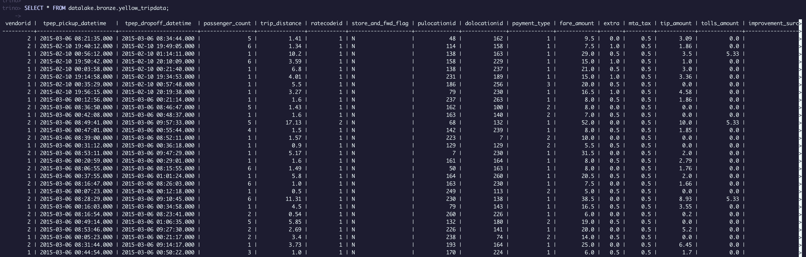
---
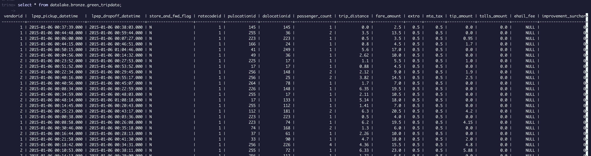
---
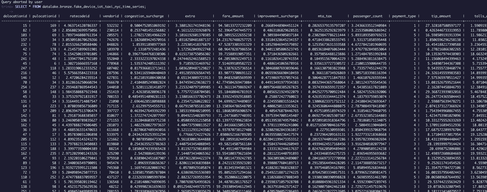


To clean up and kill all containers:

```bash
make stop_all
```

That's it Thank you for your time :)
